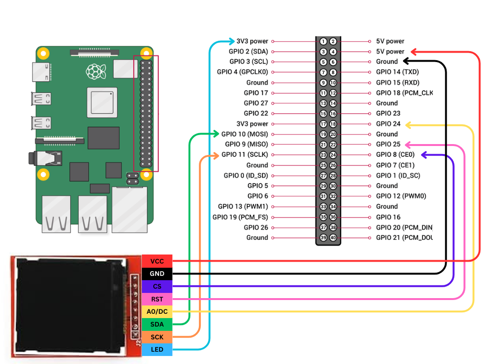

# Display_Raspberry_pi_Stats
## Displaying Raspberry pi System Stats on TFT Display(SPI)
## This python Script uses _**cskau's Python_ST7735 Library**_ :
https://github.com/cskau/Python_ST7735.git

Connect the **Raspberry Pi 4B** to **TFT ST7735 Display** using Following connection:


Install essential dependenciesusing
```
sudo apt-get update
sudo apt-get install build-essential python-dev python-smbus python-pip python-imaging python-numpy
```

For a Raspberry Pi make sure you have the RPi.GPIO and Adafruit GPIO libraries by executing:
```
sudo pip install RPi.GPIO
sudo pip install Adafruit_GPIO
```

instal it by 
```
git clone https://github.com/cskau/Python_ST7735.git
cd Python_ST7735/
python3 setup.py install
```
## Now go outside the Library and clone my repo:
```
cd ../
git clone https://github.com/DeepakDenre/Display_Raspberry_pi_Stats.git
cd Display_Raspberry_pi_Stats/
```

Test the Python Script using:
```
python3 DisplayStats.py
```
Or
```
./DisplayStats.py
```

if it works correctly then add the script to crontab to start at boot automatically(Do not use sudo as it runs crontab as superuser):
```
crontab -e
```
and add the file in the end :
```
@reboot [Path to file]/DisplayStats.py
```
or 
```
@reboot python3 [Path to file]/DisplayStats.py
```

