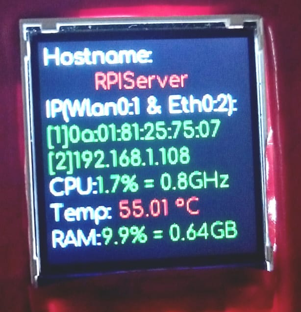

## Displaying Raspberry pi System Stats on TFT Display(SPI)
This python Script uses _**cskau's Python_ST7735 Library**_ :
https://github.com/cskau/Python_ST7735.git

Connect the **Raspberry Pi 4B** to **TFT ST7735 Display** using Following connection:


Update and install essential dependencies
```
sudo apt-get update
```
```
sudo apt-get install build-essential python3-pip git wget
```

Install one of the following python virtual env -
##### Miniconda
##### virtualenv
I recommand Miniconda, make a env, activate the env and install the following packages

For a Raspberry Pi make sure you have the RPi.GPIO, Adafruit GPIO and other libraries by executing:
```
pip3 install RPi.GPIO
```
```
pip3 install psutil
```
```
pip3 install Pillow
```
install the ST7735 Library by 
```
git clone https://github.com/cskau/Python_ST7735.git
```
```
cd Python_ST7735/
```
```
python3 setup.py install
```
## Now go outside the Library and clone my repo:
```
cd ./
wget https://github.com/DeepakDenre/Display_Raspberry_pi_Stats/archive/refs/heads/main.zip
unzip main.zip
cd Display_Raspberry_pi_Stats-main/
```

Test the Python Script using:
```
python3 DisplayStats.py
```



if it works correctly then add the script to crontab to start at boot automatically(Do not use sudo as it runs crontab as superuser):
```
crontab -e
```
and add the file in the end :
```
@reboot [path of python on virtual env(venv or conda)] [Path to file]/DisplayStats.py
```
eg -
```
@reboot /home/Server/.conda/envs/TFT/bin/python3 /home/Server/Display_Raspberry_pi_Stats-main/
DisplayStats.py
```

